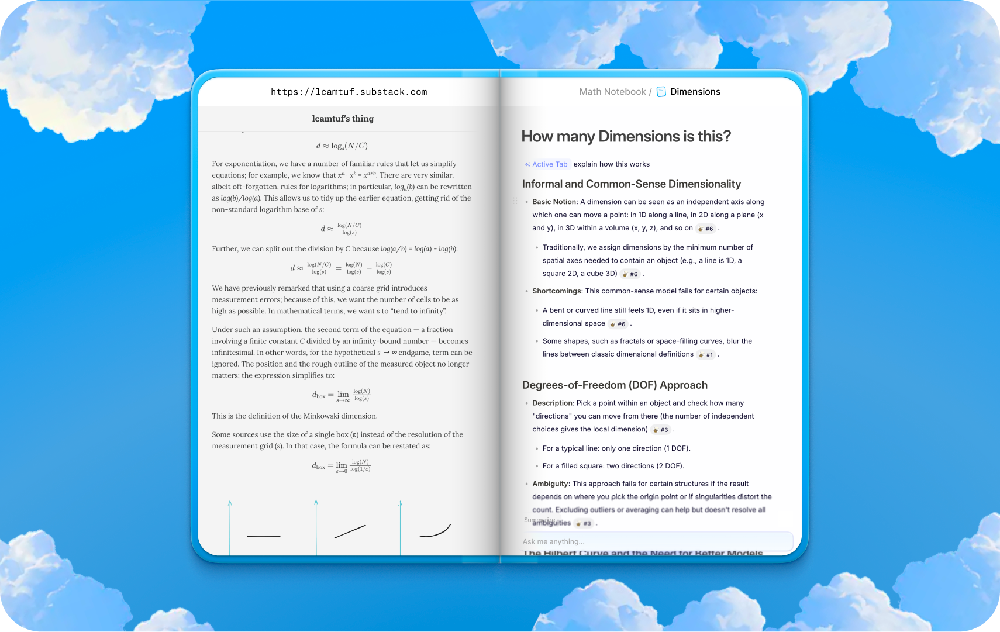
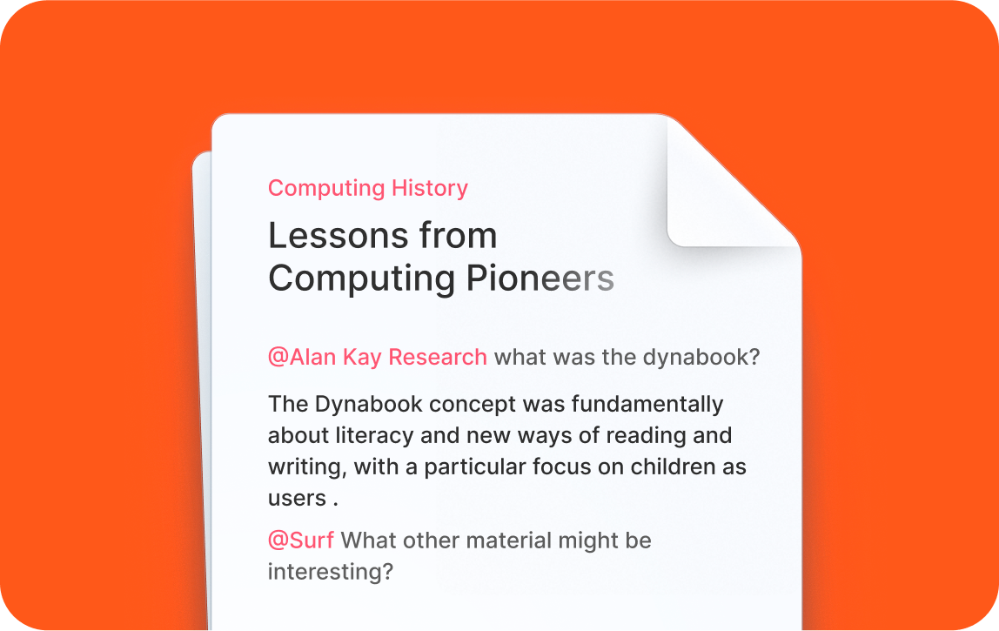

# Elevate your thinking

Deta Surf is an intelligent notebook that brings your files and the web directly into your notes.

It’s meant for simultaneous research and thinking that minimizes the grunt work: manually searching, opening windows & tabs, scrolling, copying and pasting into a document editor. Surf is primarily built in Svelte and Rust, runs on MacOS, Windows and Linux, stores data locally in open formats, and is open source.

# Motivation

We want to help people think better, across all their media.

Most applications are focused on a single task, or a single media type: notes, websites, or PDFs. Real thinking requires juggling media across sources to make connections and synthesize ideas.

Surf aims to make this easier by combining multi-media storage, web access, and intelligent document creation in a single app focused on thinking. Surf is built on the principles of decentralization and openness, in service of the user. This means local first data, open data formats, open source, and openness with respect to AI models.

# Installation

Checkout the [GitHub releases](https://github.com/deta/surf/releases) for the latest stable version of Surf for MacOS, Windows and Linux.

You can also download Surf with some managed & additional features (e.g. AI) from the Deta website. That version is subject to the [Deta Terms](https://deta.surf/terms).

For building from source and local development, see [CONTRIBUTING.md](CONTRIBUTING.md).

# Features

## Multi-Media Library & Notebooks

Surf’s foundation is a multi-media library that lives on your computer. You can add many different “resources” to this library: local files, sites from the web, or media created in Surf.

Each resource lives on your device in [local and open data formats] through a Rust storage engine called SFFS. Resources can be organized into [Notebooks](/docs/LIBRARY.md#notebooks), their text content is accessible [offline](/docs/LIBRARY.md#offline) and can be used alone or together to power Surf’s generative notes.

Read more

[Library](/docs/LIBRARY.md)

Find the most common shortcuts here

[Shortcuts](/docs/SHORTCUTS.md)

## Smart Notes

Smart Notes are multi-media notes that can be automatically generated from resources in your library and anything on the web. They are intended for exploring and thinking across lots of connected data without having to go the manual route: opening up a bunch of windows, clicking, scrolling and copying & pasting into your document (or chatbot).

A generation can be powered by a single resource or tab, an entire notebook, or the web. This is possible because of the context stored in your library and Surf’s integration with AI.

Read more:

## Surflets

Surf can code interactive applets to help you visualize, understand or explore concepts or data that are aided with code. These Surflets are embedded within the document.

Read more:

[Surflets](./docs/Surflets.md)

## AI

Surf’s notes and Surflets are powered by large language models. Surf tries to be as open and as agnostic to the model as possible.

Read more:

[AI Models](./docs/AI-Models.md)

## Shortcuts

Find the most common shortcuts [here](./docs/SHORTCUTS.md)

# Security

_To report a security concern, please see_ https://github.com/deta/surf/security/policy

# Contributing

See [CONTRIBUTING.md](CONTRIBUTING.md) for details on contributing to the project and an overview of the codebase. And please see the PR-template.

[**PULL_REQUEST_TEMPLATE.md**](PULL_REQUEST_TEMPLATE.md)

# Code of Conduct

See [CODE_OF_CONDUCT.md](CODE_OF_CONDUCT.md) for details on our code of conduct.

# License

The source code for this project is licensed under the Apache 2.0 license, with the following exceptions:

1. Our patch for the @ghostery/adblocker-electron package is licensed under the Mozilla Public License 2.0 (MPL-2.0), consistent with the upstream project's licensing.
2. Select files may contain their own specific license headers that override the default license.

Unless otherwise specified in the file or directory, all code defaults to the Apache 2.0 license.

See [LICENSE](LICENSE.md) for more details about the Apache 2.0 license.

Deta GmbH is a commercial open source company. Surf is designed to operate as open source software without Deta's servers. Deta GmbH also offers a modified version of Surf (which integrates with Deta's servers) and is subject to separate terms and conditions. This version of Surf can be downloaded from the [Deta website](https://deta.surf/) and is governed by separate terms.

**Note:** The Deta name and logos are trademarks of Deta GmbH and are **not** covered by the Apache 2.0 license.

# Acknowledgements
